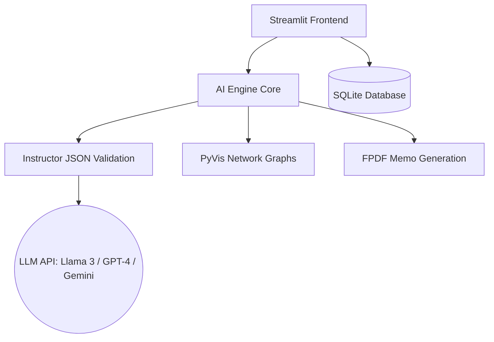
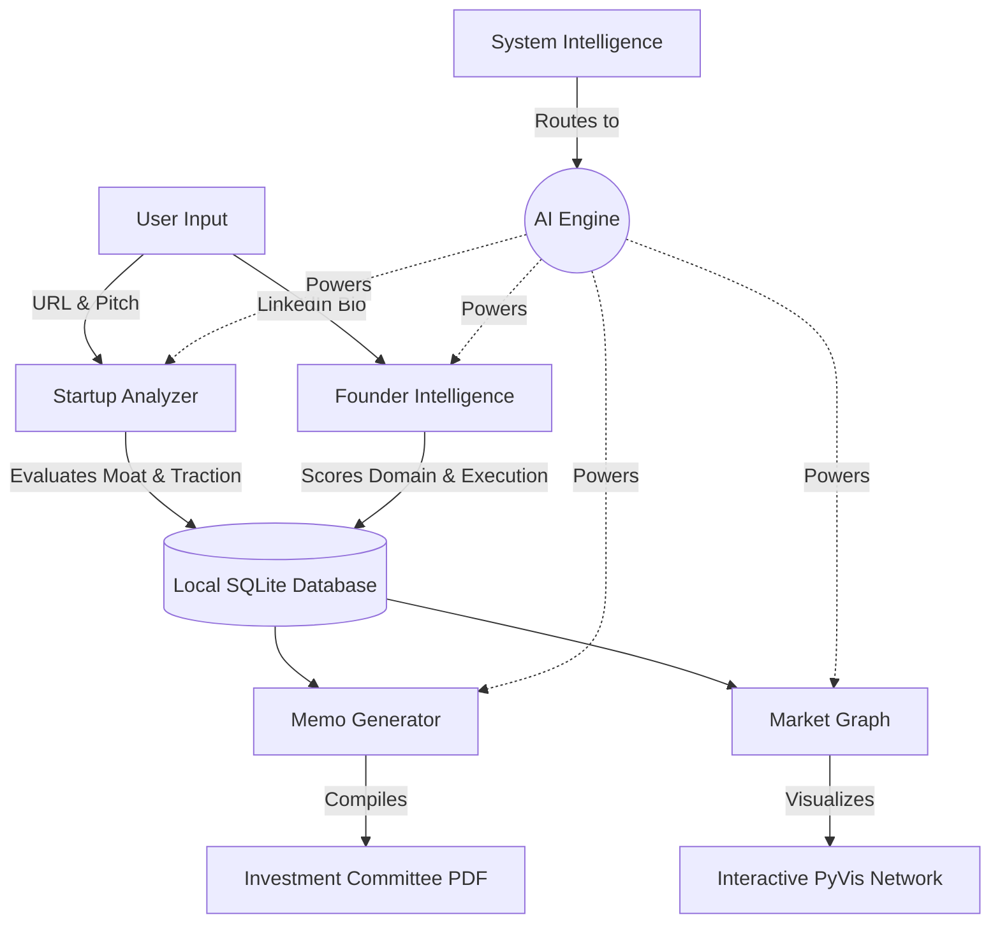

# VentureFlow AI — Venture Intelligence Operating System

> *AI-native workflow infrastructure for early-stage venture capital firms.*

VentureFlow AI is a production-ready MVP that gives venture analysts and GPs an AI-powered intelligence layer for startup evaluation, founder profiling, market mapping, and investment memo generation.

---

## What It Does

| Module | Description |
|--------|-------------|
| **Startup Analyzer** | Input a startup URL + description → AI extracts business model, competitors, moat, traction, and generates an investment score with dimensional breakdown |
| **Founder Intelligence** | Paste a founder bio → AI scores domain expertise, execution signal, founder-market fit, and generates a risk profile |
| **Memo Generator** | Pulls context from saved analyses → generates a full IC-ready investment memo with bull/bear cases, downloadable as PDF |
| **Market Graph** | Interactive PyVis network graph showing the startup's competitive landscape with colour-coded nodes |

---

## Architecture



## Workflow



---

## Setup (5 minutes)

### 1. Clone / download the project

```bash
cd path/to/VentureFlow-AI
```

### 2. Create a virtual environment

```bash
python -m venv venv

# Windows
venv\Scripts\activate

# macOS / Linux
source venv/bin/activate
```

### 3. Install dependencies

```bash
pip install -r requirements.txt
```

### 4. Configure your API key

```bash
# Copy the template
cp .env.example .env

# Edit .env and add your preferred API keys (Groq, OpenAI, or Gemini)
GROQ_API_KEY=gsk_your_key_here
```

### 5. Run the app

```bash
streamlit run 0_Home_Dashboard.py
```

The app opens at `http://localhost:8501` automatically.

---

## Project Structure

```
VentureFlow-AI/
├── 0_Home_Dashboard.py             # Home dashboard (entry point)
├── pages/
│   ├── 1_Startup_Analyzer.py       # Startup intelligence engine
│   ├── 2_Founder_Intelligence.py   # Founder profiling engine
│   ├── 3_Memo_Generator.py         # Investment memo generator
│   ├── 4_Market_Graph.py           # PyVis network graph
│   └── 5_System_Intelligence.py    # Global AI settings and configuration
├── core/
│   ├── styles.py                   # CSS design system (dark theme)
│   ├── ai_engine.py                # LLM API calls + prompts
│   ├── database.py                 # SQLite via SQLAlchemy
│   └── pdf_export.py               # FPDF PDF generation
├── data/
│   └── eximius.db                  # Auto-created SQLite database
├── .streamlit/
│   └── config.toml                 # Streamlit theme configuration
├── requirements.txt
├── .env
└── README.md
```

---

## Tech Stack

| Layer | Technology |
|-------|-----------|
| **Frontend** | Streamlit + custom CSS (glassmorphism, dark mode) |
| **AI** | Llama-3 / GPT-4 with JSON mode structured outputs |
| **Database** | SQLite via SQLAlchemy (auto-created) |
| **Graph** | PyVis (force-directed network visualization) |
| **PDF** | FPDF (institutional memo PDF generation) |

---

## Demo Workflow

### Recommended demo sequence:

**Step 1 — Startup Analysis**
1. Navigate to **Startup Analyzer**
2. Enter: `Figma` + `https://figma.com` + "collaborative design tool for teams"
3. Click **Analyze**
4. Review the investment score, competitive analysis, and diligence questions

**Step 2 — Founder Intelligence**
1. Navigate to **Founder Intelligence**
2. Paste a LinkedIn bio (real or synthetic)
3. Review the dimensional score card and risk indicators

**Step 3 — Investment Memo**
1. Navigate to **Memo Generator**
2. Load the Figma analysis from the dropdown
3. Click **Generate**
4. Download the PDF

**Step 4 — Market Graph**
1. Navigate to **Market Graph**
2. Load the Figma analysis
3. Click **Generate**
4. Interact with the force-directed network

---

## Deployment (Free)

The easiest way to deploy VentureFlow AI to the web is via **Streamlit Community Cloud**:

1. Go to [share.streamlit.io](https://share.streamlit.io/) and log in with your GitHub account.
2. Click **New app**.
3. Fill in the details:
   - **Repository:** `amitbaghel001/VentureFlow-AI`
   - **Branch:** `main`
   - **Main file path:** `0_Home_Dashboard.py`
4. **CRITICAL STEP:** Click on **Advanced settings** (before deploying) and paste your API keys into the "Secrets" box exactly like your `.env` file:
   ```toml
   GROQ_API_KEY="gsk_your_key_here"
   GEMINI_API_KEY="AIzaSy..."
   OPENAI_API_KEY="sk-..."
   ```
5. Click **Deploy!** Your app will be live globally in about 2 minutes.

---

## License

Internal use only. Not for distribution.

---

*Built with VentureFlow AI · AI-native workflow infrastructure*
