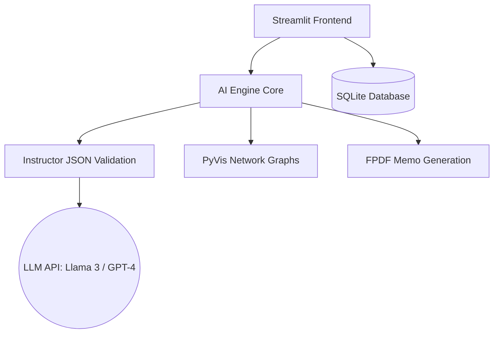

<div align="center">
  
  <h1 align="center">VentureFlow AI</h1>
  <p align="center">
    <strong>AI-native workflow infrastructure for modern venture capital teams.</strong>
  </p>
  <p align="center">
    <a href="#system-overview">System Overview</a> •
    <a href="#feature-showcase">Feature Showcase</a> •
    <a href="#architecture">Architecture</a> •
    <a href="#deployment">Deployment</a>
  </p>
</div>

<br/>

## ⬡ System Overview

VentureFlow AI is an institutional-grade venture intelligence platform. It acts as an autonomous operating system for venture funds, transforming unstructured external data (startup websites, founder profiles, market shifts) into highly structured, actionable investment intelligence. 

Designed with the restraint and density of institutional software (like Bloomberg Terminal or Palantir), it eliminates the busywork of early-stage diligence, allowing high-agency partners and analysts to focus purely on decision-making.

---

## ⬡ Feature Showcase

### 1. Operations Dashboard
The mission control for the intelligence system. Features real-time market signals, system activity logs, and immediate access to the core analytical modules. 
> *[Dashboard Screenshot Placeholder]*

### 2. Startup Intelligence Engine
Input a startup URL and the LLM engine autonomously extracts the business model, evaluates moats, identifies risks, and outputs a dimensional investment score in JSON format.
> *[Startup Analyzer Screenshot Placeholder]*

### 3. Founder Intelligence Engine
Extracts execution velocity signals, domain expertise, and founder-market fit directly from a founder's LinkedIn bio or profile text, formatting it into a concise founder intelligence card.
> *[Founder Engine Screenshot Placeholder]*

### 4. Cinematic Market Graph
A dynamic, PyVis-powered network graph that maps direct competitors, adjacent companies, and overarching market sectors. It utilizes gravitational physics to cluster related entities.
> *[Market Graph Screenshot Placeholder]*

### 5. Institutional Memo Generator
Compiles existing startup analyses, founder profiles, and analyst notes into an institutional-grade investment committee memo, ready for export as a PDF.
> *[Memo Engine Screenshot Placeholder]*

---

## ⬡ Architecture

VentureFlow AI uses a tightly integrated modern AI stack.



- **Frontend:** Streamlit deeply customized via CSS injection (`core/styles.py`) for a cinematic, dark-mode institutional UI.
- **AI Core:** `instructor` + `pydantic` are used to guarantee strict JSON output from LLMs for reliable parsing.
- **LLM Support:** Seamlessly integrates with Groq (Llama-3), OpenAI, and Google Gemini via `.env` configuration.
- **Persistence:** Local SQLite via SQLAlchemy (`core/database.py`) tracks all historical analyses.

---

## ⬡ Deployment & Setup

### Prerequisites
- Python 3.10+
- Valid API Key (Groq recommended for speed, OpenAI/Gemini supported)

### 1. Initialization
```bash
git clone https://github.com/amitbaghel001/VentureFlow-AI.git
cd VentureFlow-AI
pip install -r requirements.txt
```

### 2. Environment Configuration
Create a `.env` file in the root directory:
```env
# AI Model Keys (Provide at least one)
GROQ_API_KEY=gsk_...
OPENAI_API_KEY=sk-...
GEMINI_API_KEY=AIzaSy...
```

### 3. Launch System
```bash
streamlit run 0_Home_Dashboard.py
```
*The system will automatically initialize the local database and seed a sample institutional analysis.*

---
<div align="center">
  <p><em>VentureFlow AI · AI-native workflow infrastructure</em></p>
</div>
